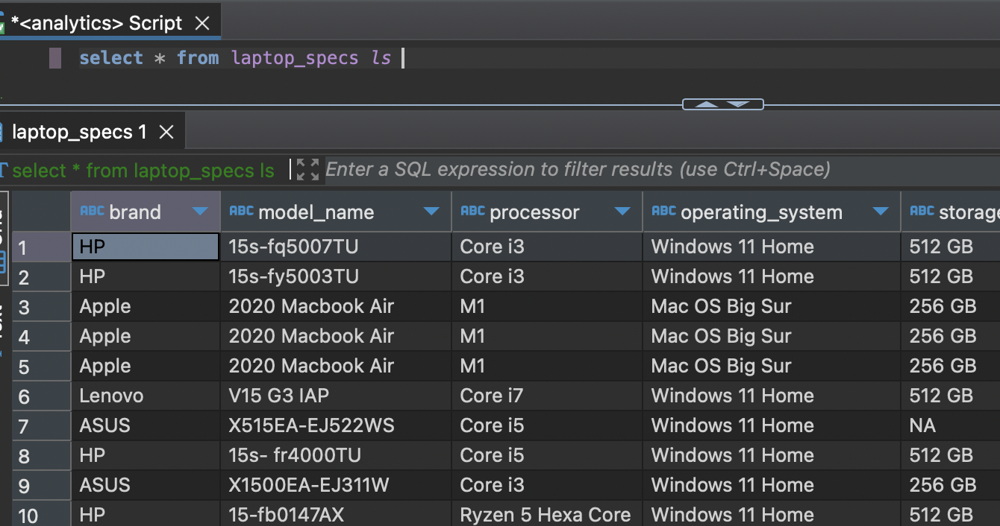

# Instructions

Install and create the following:
- $ pip install pandas psycopg2
- Create *cred.json* inside **/config** directory    
     ```sql
        {
        "username": "____",
        "password": "___"
        }  
- In Postgres terminal as admin/superuser
    - $ GRANT CONNECT ON DATABASE [db_name] to [user/role];
    - $ GRANT CREATE ON SCHEMA [schema_name] to [user/role];
    
